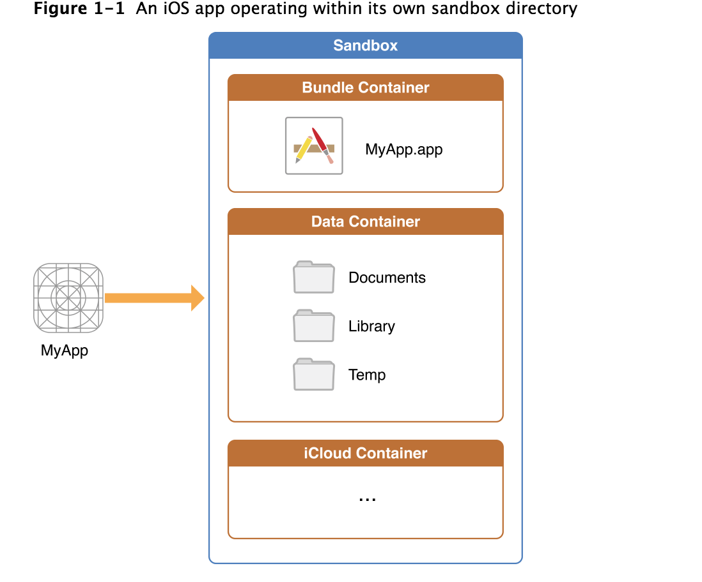
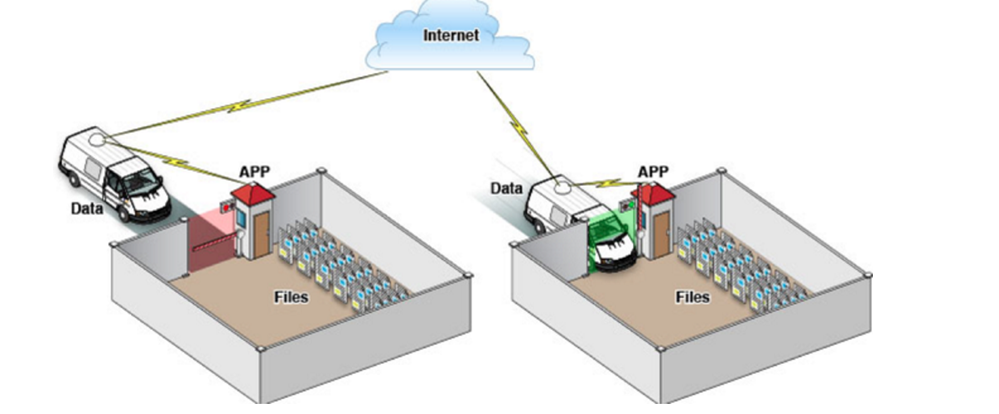
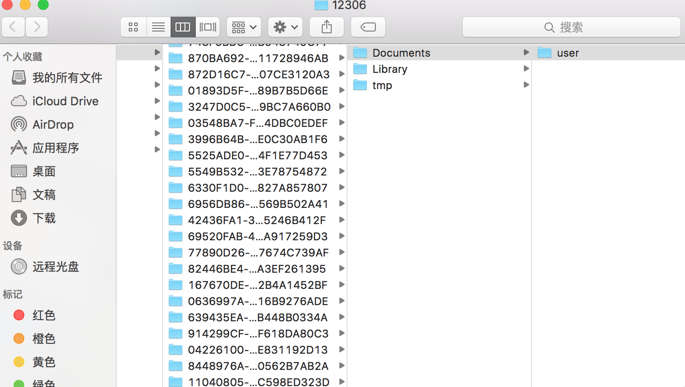

# iOS沙盒机制

## 沙盒机制

  不好意思,我又一次来到了你们的世界,其实我是拒绝的,但是我的无法忍受内心的躁动!额我TMD的在说什么胡话,bug改的脑子都坏了吧.回到正题今天要给大家分享的是iOS的沙盒机制.

先来看一张苹果官方文档的图吧.

1. 我们从这张图可以看到,我们的每个应用都分为Bundle Container和Data Container和iCloud Container三个文件,今天我们主要研究的是Data Container.可以看到三个目录我们是否感觉非常熟悉,一个是Documents,一个是Library,一个是Temp文件.
2.  先不介绍这三个文件了,先学习一下沙盒机制吧.iOS应用程序只能在改程序所创建的文件系统中读取文件,不可以去访问其他应用的文件.此区域就成为沙盒.可以理解为一个密不透风的盒子,你只能在这个盒子当中读取文件和存入文件,不能存到隔壁老王家的沙盒中.这些文件可以保存非代码的文件,比如:图像，图标，声音，映像，属性列表，文本文件等.
3.  每个应用程序都有自己的存储空间,每个应用程序不能翻过自己的围墙去访问别的存储空间的内容,应用请求的数据都要通过权限检测,假如没有通过,就不能请求该文件的数据.

通过下面的图来看一下苹果的沙盒机制吧.

   通过这张图只能从表层上理解sandbox是一种安全体系，应用程序的所有操作都要通过这个体系来执行，其中核心内容是：sandbox对应用程序执行各种操作的权限限制。
   

## 沙盒目录
1. 刚才我们已经看过了沙盒的目录了,包含document,library,Temp三个文件,这三个文件一般是不可见的,有两种方式可以查找文件的具体目录:
  
  1.1 可以设置显示隐藏文件，然后在Finder下直接打开。设置查看隐藏文件的方法如下：打开终端，输入命名
显示Mac隐藏文件的命令：defaults write com.apple.finder AppleShowAllFiles -bool true
隐藏Mac隐藏文件的命令：defaults write com.apple.finder AppleShowAllFiles -bool false
输完单击Enter键，退出终端，
重新启动Finder就可以了重启Finder：鼠标单击窗口左上角的苹果标志-->强制退出-->Finder-->
现在能看到资源库文件夹了。

  1.2 这种方法更方便，在Finder上点->前往->前往文件夹，输入/Users/username/Library/Application Support/iPhone Simulator/ 前往。userName使用你的用户名
  
  
如果你看了和我这张效果图一样的文件目录层级,证明你已经找到了沙盒文件的目录.

## 沙盒文件各自的作用

documents:苹果建议将程序中建立的活在程序中浏览到的文件数据保存在该目录下,还有ituns备份的资料也放在该文件下.

library:存储程序的默认设置和其他信息.

library/Caches:存放缓存的文件,可以存储一些缓存数据.

library/Preferences:存放一些偏好设置等文件.

tmp:提供一个临时创建文件的地方,在退出程序后删除.

## 沙盒文件的操作

1. 获取程序的home目录

  NSString *homeDirectory = NSHomeDirectory();
  
  NSLog(@"path:%@", homeDirectory);
2. 获取document目录

  NSArray *paths = NSSearchPathForDirectoriesInDomains(NSDocumentDirectory, NSUserDomainMask, YES);
  
  NSString *path = [paths objectAtIndex:0];
  
  NSLog(@"path:%@", path); 
  
3. 获取Cache目录
NSArray *paths = NSSearchPathForDirectoriesInDomains(NSCachesDirectory, NSUserDomainMask, YES);

  NSString *path = [paths objectAtIndex:0];

  NSLog(@"%@", path);
4. 获取Library目录

  NSArray *paths = NSSearchPathForDirectoriesInDomains(NSLibraryDirectory, NSUserDomainMask, YES);
  
  NSString *path = [paths objectAtIndex:0];
  
  NSLog(@"%@", path);
5.  获取Tmp目录

  NSString *tmpDir = NSTemporaryDirectory();
  
  NSLog(@"%@", tmpDir);
6. 写入文件

  NSArray *paths = NSSearchPathForDirectoriesInDomains(NSDocumentDirectory, NSUserDomainMask, YES);

  NSString *docDir = [paths objectAtIndex:0];
  
  if (!docDir) {
  
      NSLog(@"Documents 目录未找到");        
  }
  
  NSArray *array = [[NSArray alloc] initWithObjects:@"内容",@"content",nil];
  
  NSString *filePath = [docDir stringByAppendingPathComponent:@"testFile.txt"];
    
  [array writeToFile:filePath atomically:YES];

7. 读取文件

  NSArray *paths = NSSearchPathForDirectoriesInDomains(NSDocumentDirectory, NSUserDomainMask, YES);
  
  NSString *docDir = [paths objectAtIndex:0];
  
  NSString *filePath = [docDir stringByAppendingPathComponent:@"testFile.txt"];
    
  NSArray *array = [[NSArray alloc]initWithContentsOfFile:filePath];
    
  NSLog(@"%@", array);
  
  
## 使用NSFileManager进行文件操作

在我这次做epub3于都器的时候遇到一个问题,就是使用af3.1.0后,af会将文件直接保存到document文件下,但是我想早document目录下的用户目录下的用户名目录下的bookId目录下保存文件,但是不知道到底怎么在document下创建子文件夹,最后通过查找资料和查看苹果官方文档最终完成了下载到指定文件目录下.temp也类似,自己可以下去自己研究在这不做解释.

### 保存文件到指定文件

 NSString* filePath = [LQEpubFileManager getFilePathWithUserId:userId fileName:bookId];
 
NSFileManager *fileManager = [NSFileManager defaultManager];

NSError* error;

BOOL isSuccess = [fileManager createDirectoryAtPath:filePath withIntermediateDirectories:YES attributes:nil error:&error];

NSString *path;

if (isSuccess == YES) {

  path = [filePath stringByAppendingPathComponent:response.suggestedFilename];
   
  }
  
return [NSURL fileURLWithPath:path];

### 获取目录列所有文件名

 NSArray *paths = NSSearchPathForDirectoriesInDomains(NSDocumentDirectory, NSUserDomainMask, YES); 
 
 NSString *documentsDirectory = [paths objectAtIndex:0]; 
 
 NSLog(@"documentsDirectory%@",documentsDirectory);  
 
 NSFileManager *fileManage = [NSFileManager defaultManager]; 
 
 NSString *myDirectory = [[documentsDirectory stringByAppendingPathComponent:@"weiqi"]stringByAppendingPathComponent:@"12306"];  
 
 NSArray *file = [fileManage subpathsOfDirectoryAtPath: myDirectory error:nil]; 
 NSLog(@"%@",file);  
 
 NSArray *files = [fileManage subpathsAtPath: myDirectory ]; 
 
 NSLog(@"%@",files); 

### 删除文件

[fileManager removeItemAtPath:fileName error:nil];

# 总结

沙盒机制保证了我们每一个应用程序的安全性,只能访问自己沙盒文件下的文件.NSFileManager帮助哦我们很好的管理沙盒文件下的文件.对文件进行操作使用NSFileManager操作沙盒文件十分简单.今天就总结到这里.

